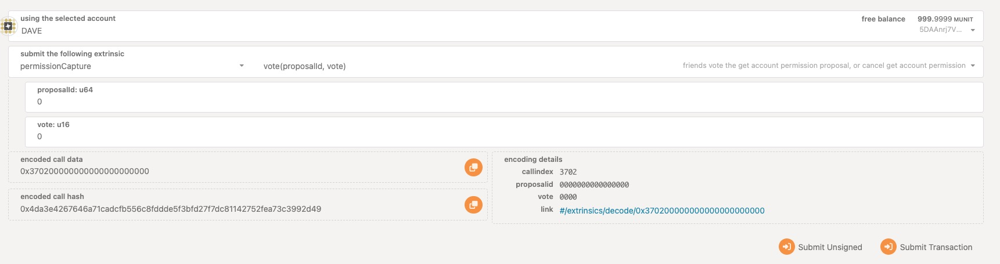

# pallet-permission-capture
## 1 alice create capture config by create_capture_config, then submit transaction 

the params is 
* BOB
* CHARLIE
* DAVE
* 2

## 2 alice find private key lost, let bob to call get_account_permissions, create a proposal for give the account permission to friends.

## 3 charlie agree proposal  (2 is the min permission threshold, now bob and charlie agree, match the pass conditions), then alice's tranfer must be agree by alice's friends

get activeCaptures executeProposalId by permissionCapture.activeCaptures(ALICE)

vote the activeCaptures proposal, now executeProposalId is 0

## 4 dave agree proposal

## 5 check the map mapPermissionTaken, find there is alice address in map.

## 6 alice safeTransfer to bob 5000000000000 token

## 7 bob agree the call hash
get alice call hash by permissionCapture.activeCalls, now is 0x88b20b87232415b479b49446ce02c3f2d4e6baeadc361b5b1e04b86c467b8843

vote the call hash

## 8 charlie agree the call hash

## 9 get the transfer event

## ref
* `create_get_account_permissions` - A friend initiates a proposal, and the ownership of the application address is transferred to the status of friend management.
* `cancel_get_account_permissions` - A friend cancels a proposal initiated by himself.
* `vote` - When the account is in takeover state, friends can use this method to vote on the address transaction application.
* `create_capture_config` - The user creates a power grab configuration and writes his friend list into this method.
* `operational_voting` - vote for call hash of permission owner's.

## more info: 
see testcase in https://github.com/redstone-network/redstone-node/blob/main/pallets/permission-capture/src/tests.rs

see api doc in https://redstone-node-doc.vercel.app/pallet_permission_capture/pallet/struct.Pallet.html#

# pallet-defense and pallet-notification

1
2
3
4
5
6

## ref
pallet-notification
* `set_mail` - Configure Email alert methods for users.
* `set_slack` - Configure Slack alert methods for users.
* `set_discord` - Configure Discord alert methods for users.

pallet-defense
* `set_transfer_limit` - The transaction limit and transaction frequency of the user-configured address.
* `set_risk_management` - Freezing time for user-configured addresses.
* `safe_transfer` - Transfer method, check whether the transfer is safe according to user configuration.
* `freeze_account` - Trigger the freezing operation, after the user clicks, the account cannot be transferred within the specified time.

more info: see testcase in https://github.com/redstone-network/redstone-node/blob/main/pallets/defense/src/tests.rs

see api doc in https://redstone-node-doc.vercel.app/pallet_defense/pallet/struct.Pallet.html#